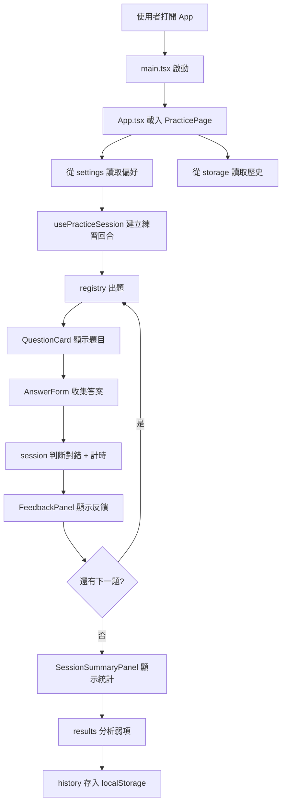

# QuickMath Trainer 專案資料夾導覽

> 這份文件用通俗的語言，解釋 QuickMath Trainer（QuickMathOwo）專案裡每個資料夾和檔案在做什麼。

---

## 先講一個大比喻：這個 App 像什麼？

想像你開了一間 **「速算健身房」**：

| 比喻 | 對應到專案 |
|------|-----------|
| 健身房的大門、招牌、燈光 | `index.html`、`main.tsx`、`styles/` |
| 櫃台與動線規劃（帶你去哪個區域） | `src/app/` |
| 實際的訓練課程（出題、作答、計時） | `src/features/practice/` |
| 出題機器人（自動出數學題） | `src/features/questions/` |
| 成績單與訓練紀錄 | `src/features/results/` |
| 你的個人設定（難度、題數） | `src/features/settings/` |
| 通用工具（螺絲起子、尺、收納盒） | `src/shared/` |
| 設計圖與企劃書 | `docs/` |
| 品管檢查（確認機器正常運作） | `*.test.ts`、`vitest.setup.ts` |

**為什麼要分這麼多資料夾？**

就像健身房不會把「跑步機」、「淋浴間」、「會計帳本」全部堆在同一個房間——分開放，找東西快、改東西不會互相踩到、以後擴充也清楚知道新功能該放哪。

---

## 專案根目錄（最外層）

```
quickmathowo/
├── docs/              ← 企劃與架構文件
├── src/               ← 所有程式碼（App 本體）
├── index.html         ← 網頁的「空殼」
├── package.json       ← 專案清單（用了哪些套件、有哪些指令）
├── vite.config.ts     ← 建置工具設定
├── vitest.setup.ts    ← 測試環境的開機設定
├── tsconfig*.json     ← TypeScript 語言規則
└── .gitignore         ← 告訴 Git 哪些檔案不用追蹤
```

### 各檔案說明

| 檔案 | 做什麼 | 比喻 |
|------|--------|------|
| `index.html` | 瀏覽器載入的最小 HTML，裡面只有一個 `<div id="root">` 讓 React 掛上去 | 健身房的空店面，等裝潢團隊進來 |
| `package.json` | 記錄專案名稱、依賴套件、可執行的指令（`npm run dev`、`npm test`） | 健身房開業清單：器材清單 + 操作手冊 |
| `package-lock.json` | 鎖定每個套件的精確版本，確保大家裝到一樣的東西 | 器材型號的固定規格表 |
| `vite.config.ts` | 設定 Vite（開發伺服器 + 打包工具）和 Vitest（測試框架） | 水電與管線的配置圖 |
| `vitest.setup.ts` | 測試執行前載入 `@testing-library/jest-dom`，讓測試能檢查 DOM | 品管室開機前的標準檢查表 |
| `tsconfig.json` | TypeScript 主設定 | 全館共同遵守的書寫規範 |
| `tsconfig.app.json` | 給 App 原始碼用的 TS 設定 | 教練區的專用規範 |
| `tsconfig.node.json` | 給 Node 工具（如 Vite 設定檔）用的 TS 設定 | 後台工具的專用規範 |
| `.gitignore` | 排除 `node_modules` 等不需要上傳 Git 的檔案 | 哪些東西不用放進保險箱 |

---

## `docs/` — 企劃書與設計圖

這裡放的是 **「文字版藍圖」**，不是會跑起來的程式。

| 檔案 | 內容 |
|------|------|
| `01-product-vision.md` | 產品願景：這是給誰用的、解決什麼問題 |
| `02-prd.md` | 產品需求文件（PRD）：功能規格 |
| `03-user-stories.md` | 使用者故事：「身為學生，我希望…」 |
| `04-system-design.md` | 系統設計：各模組怎麼互動 |
| `05-roadmap.md` | 路線圖：先做什麼、後做什麼 |
| `06-tasks.md` | 具體任務清單 |
| `07-frontend-architecture.md` | 前端架構：資料夾怎麼分、誰負責什麼 |
| `08-technical-stack.md` | 技術棧：React、Vite、TypeScript 等 |
| `10-mental-cost.md` | **心算成本（Mental Cost）完整規格**：公式、20 種計算模板、32 種題目模板範例 |
| `ai-rules.md` | 給 AI 協作用的規則 |
| `decision-assistant.md` | 決策輔助筆記 |
| `09-project-folder-guide.md` | 就是這份文件 |

**比喻**：這是健身房的創業計畫書、裝潢圖、SOP 手冊，開店前寫好，之後改功能時可以回頭對照。

---

## `src/` — App 本體

所有會跑起來的 React / TypeScript 程式碼都在這裡。

```
src/
├── main.tsx           ← 程式入口（開機按鈕）
├── vite-env.d.ts      ← Vite 的型別宣告
├── app/               ← 應用組裝層
├── features/          ← 四大功能模組
├── shared/            ← 通用工具
└── styles/            ← 全域樣式
```

---

### `src/main.tsx` — 開機按鈕

把 React App 掛到 `index.html` 的 `#root` 上，並載入全域 CSS。

**比喻**：按下健身房的總電源，燈亮了、冷氣開了，客人可以進來了。

---

### `src/app/` — 櫃台與動線

負責 **組裝** 各功能模組，但不自己出題、不算分。

| 檔案 / 資料夾 | 做什麼 | 比喻 |
|--------------|--------|------|
| `App.tsx` | 最上層元件，包住 Providers 並顯示練習頁 | 健身房大廳，決定客人一進門看到什麼 |
| `providers.tsx` | 集中放全域 Provider（目前只是直接回傳 children，預留擴充） | 全館共用的空調 / Wi-Fi 系統接口 |
| `routes/PracticePage.tsx` | 練習頁：把設定、練習流程、歷史紀錄組合成一個完整頁面 | 訓練區的完整體驗：選課 → 練習 → 看成績 |
| `routes/PracticePage.module.css` | 練習頁專屬樣式 | 訓練區的裝潢 |

**為什麼要有 `app/` 和 `features/` 的分工？**

`app/` 像 **導遊**，只負責「把客人帶到對的地方、把各區服務串起來」；  
`features/` 像 **各專業教練**，各自懂自己的領域。

這樣以後加「設定頁」、「歷史紀錄頁」，只要在 `routes/` 新增頁面，把對應 feature 組合進去就好。

---

### `src/features/` — 四大功能模組

這是 App 的 **心臟**。每個子資料夾負責一塊完整的產品能力。

```
features/
├── practice/    ← 練習流程（一輪 Flashcard 怎麼跑）
├── questions/   ← 出題引擎（題目怎麼生出來）
├── results/     ← 成績與弱項分析
└── settings/    ← 使用者偏好設定
```

#### 為什麼 features 要再分子資料夾？

就像速算健身房分「有氧區」、「重訓區」、「體測室」——  
每個區域的器材和流程不同，分開管理才不會改跑步機時不小心弄壞啞鈴架。

---

#### `features/practice/` — 練習流程

**比喻**：一節 Flashcard 訓練課的 **教練**，管整堂課的節奏。

| 檔案 | 功能 |
|------|------|
| `session.ts` | 練習回合的核心邏輯：建立 session、提交答案、判對錯、前進下一題、結束回合 |
| `types.ts` | 定義 `PracticeSession`（一輪練習的狀態）等型別 |
| `hooks/usePracticeSession.ts` | React Hook，把 `session.ts` 的邏輯包成元件可用的狀態（submit、next、restart） |
| `components/QuestionCard.tsx` | 顯示題目卡片：第幾題、難度、題目文字、解題提示 |
| `components/AnswerForm.tsx` | 答案輸入區：填空或選擇題 |
| `components/FeedbackPanel.tsx` | 答題後的反饋：對/錯、正確答案、用時、「下一題」按鈕 |
| `components/SessionSummaryPanel.tsx` | 一輪結束後的成績摘要與弱項建議 |
| `components/PracticeComponents.module.css` | 上述練習元件的共用樣式 |

**練習流程（簡化版）**：

```
開始 → 顯示題目 → 使用者作答 → 顯示反饋 → 下一題 → … → 回合結束 → 顯示統計
         ↑                              ↓
    QuestionCard                   FeedbackPanel
         ↑                              ↓
              session.ts 管所有狀態轉換
```

`practice` **不自己出題**，它向 `questions` 要題目；**不自己存歷史**，它把作答交給 `results` 處理。

---

#### `features/questions/` — 出題引擎

**比喻**：一台 **智能出題機器人**，你告訴它「中等難度、混合模式」，它就吐出一道合格的數學題。

| 檔案 | 功能 |
|------|------|
| `types.ts` | 定義 `Question`（題目長什麼樣）、`QuestionType`（四則/分數/冪次）、難度、心算成本（1–11）等 |
| `selectionPolicy.ts` | 出題模板選擇權重與約束的唯一來源（小數上限、難模板比例、主題聚焦、硬排除） |
| `calculationTemplates.ts` | 各計算模板的 baseCost 規則與 `calculateMentalCost()` |
| `mentalCost.ts` | difficulty 加權選題分佈（bucket） |
| `templates.ts` | 題目模板庫：例如「平方差」「分數通分」等，並拆成 calculation templates 計算 cost |
| `constraints.ts` | 品質檢查：題目有沒有重複 ID、選擇題選項是否合法 |
| `registry.ts` | 題型登記處：先抽目標 mentalCost bucket，再重試生成符合的題目 |
| `tags.ts` | 技能標籤（加法、乘法、分數…）及其中文名稱 |
| `utils.ts` | 純函式工具：亂數、洗牌、答案正規化、判斷答案是否正確 |
| `generators/arithmetic.ts` | 整數四則運算出題器 |
| `generators/fractions.ts` | 分數與小數出題器 |
| `generators/powers.ts` | 冪次與根號出題器 |
| `generators/utils.ts` | 生成器共用邏輯：從模板池挑一個、依標籤過濾 |

**出題流程（像工廠流水線）**：

```
Practice 說「我要一題」
    ↓
registry 選題型（四則？分數？冪次？）
    ↓
generator 從 templates 挑一個模板，產生候選題
    ↓
constraints 檢查品質（不能太難、不能重複）
    ↓
通過 → 回傳 Question 給 Practice
```

**為什麼 generators 要分開？**

每種數學題的出題邏輯完全不同。四則運算和三角函數（未來可能加入）是不同「產線」，分開寫才好維護、也好加新題型。

**為什麼 questions 不依賴 React？**

出題邏輯是 **純計算**，跟畫面無關。獨立出來可以單獨寫測試，不用開瀏覽器就能驗證「這台出題機有沒有出錯題」。

---

#### `features/results/` — 成績與弱項分析

**比喻**：健身房的 **體測室 + 訓練日誌**，記錄你每次練得怎樣、哪裡需要加強。

| 檔案 | 功能 |
|------|------|
| `types.ts` | 定義 `Attempt`（單次作答紀錄）、`SessionSummary`（一輪統計）、`PracticeHistoryEntry`（歷史條目） |
| `summary.ts` | 計算一輪練習的統計：題數、正確率、平均用時、錯題列表 |
| `history.ts` | 把一輪練習打包成可儲存的歷史紀錄，並管理「最近 N 次」 |
| `weakness.ts` | 弱項診斷：依題型與技能標籤分析哪些能力偏弱 |
| `weaknessProfile.ts` | 從歷史紀錄推導「弱項專攻」應該練哪些標籤和題型 |

**弱項診斷的閉環**：

```
混合練習 → 累積作答紀錄 → 分析弱項 → 弱項專攻模式 → 再練 → 再分析
```

這是 QuickMath 的核心特色之一：不只告訴你「對了幾題」，還告訴你「哪裡需要加強」。

---

#### `features/settings/` — 使用者設定

**比喻**：你的 **會員卡設定**：預設練什麼、多難、做幾題。

| 檔案 | 功能 |
|------|------|
| `types.ts` | 定義 `PracticePreferences`（模式、難度、題數、選中的題型等） |
| `preferences.ts` | 預設設定值、設定正規化（確保值合法） |
| `sessionLength.ts` | 練習長度預設：低檔 10 題、中檔 20 題、高檔 50 題 |

設定本身 **不直接碰瀏覽器**，存取交給 `shared/storage`。

---

### `src/shared/` — 通用工具箱

**比喻**：健身房共用的 **螺絲起子、收納盒、通用按鈕**——任何區域都能用，但本身不懂「數學練習」是什麼。

| 路徑 | 功能 |
|------|------|
| `components/Button.tsx` | 通用按鈕（primary / secondary / ghost 三種風格） |
| `components/Button.module.css` | 按鈕樣式 |
| `components/Card.tsx` | 通用卡片容器 |
| `components/Card.module.css` | 卡片樣式 |
| `utils/format.ts` | 格式化工具：毫秒 → 「3.2s」、小數 → 「85%」 |
| `storage/localStorageAdapter.ts` | 封裝 localStorage 的讀寫，以後可換成 IndexedDB 或雲端 |

**判斷標準**：如果程式碼知道「這是數學題」或「這是一次練習作答」，它就不該放在 `shared/`，而應放在對應的 `features/` 裡。

---

### `src/styles/` — 全域樣式

| 檔案 | 功能 |
|------|------|
| `global.css` | 全站共用的 CSS（字體、背景色、基本 reset 等） |

元件專屬的樣式（如 `PracticeComponents.module.css`）放在元件旁邊，這是常見的最佳實踐：**樣式跟著元件走**。

---

## 測試檔案（`*.test.ts`）

| 檔案 | 測什麼 |
|------|--------|
| `features/questions/registry.test.ts` | 出題登記處是否正常運作 |
| `features/questions/utils.test.ts` | 答案比對、亂數等工具函式 |
| `features/results/summary.test.ts` | 統計計算是否正確 |
| `features/results/weaknessProfile.test.ts` | 弱項推導邏輯 |
| `features/settings/sessionLength.test.ts` | 練習長度設定 |

**比喻**：品管人員定期檢查出題機有沒有出錯題、計分器有沒有算錯——不用真的開 App 也能驗證。

---

## 整體資料流：一次完整練習

用「客人來健身房練一輪」的角度串起來：



---

## 常見問題

### Q：為什麼不把所有程式寫在一個大檔案？

就像不會把整間健身房的器材、帳本、淋浴間全部塞在一個房間。檔案太大時：
- 找 bug 像大海撈針
- 改一個功能可能弄壞另一個
- 多人（或未來的 AI）協作時容易衝突

### Q：`app/` 和 `features/practice/` 都有 UI，差在哪？

- `app/routes/`：頁面級的 **組裝**（把設定面板 + 練習區 + 歷史區拼在一起）
- `features/practice/components/`：練習流程專用的 **零件**（題卡、答案框、反饋面板）

### Q：為什麼有些資料夾有 README.md？

那是給開發者（和 AI 協作工具）看的 **簡短說明牌**，說明這個資料夾的責任邊界，避免把程式放錯地方。

### Q：以後加新題型（例如三角函數）要改哪裡？

1. 在 `questions/templates.ts` 加新模板
2. 在 `questions/generators/` 加新生成器（或擴充現有的）
3. 在 `questions/registry.ts` 註冊新題型
4. 在 `questions/types.ts` 更新 `QuestionType`

其他模組（practice、results）通常 **不用大改**，因為它們只跟標準的 `Question` 物件打交道。

---

## 一張表快速對照

| 資料夾 | 一句話 | 比喻 |
|--------|--------|------|
| `docs/` | 企劃書與架構文件 | 創業計畫書 |
| `src/app/` | 入口、路由、頁面組裝 | 櫃台與動線 |
| `src/features/practice/` | 一輪 Flashcard 練習流程 | 訓練教練 |
| `src/features/questions/` | 出題引擎與題目品質 | 出題機器人 |
| `src/features/results/` | 成績統計與弱項診斷 | 體測室 + 訓練日誌 |
| `src/features/settings/` | 使用者偏好 | 會員卡設定 |
| `src/shared/` | 通用 UI 與工具 | 共用工具箱 |
| `src/styles/` | 全域 CSS | 全館基本裝潢 |

---

*這份文件對應專案 QuickMath Trainer（QuickMathOwo）的目前結構。若之後新增頁面或題型，可回來更新此導覽。*
